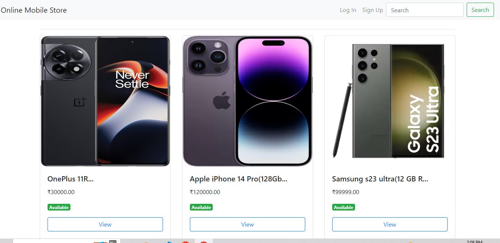
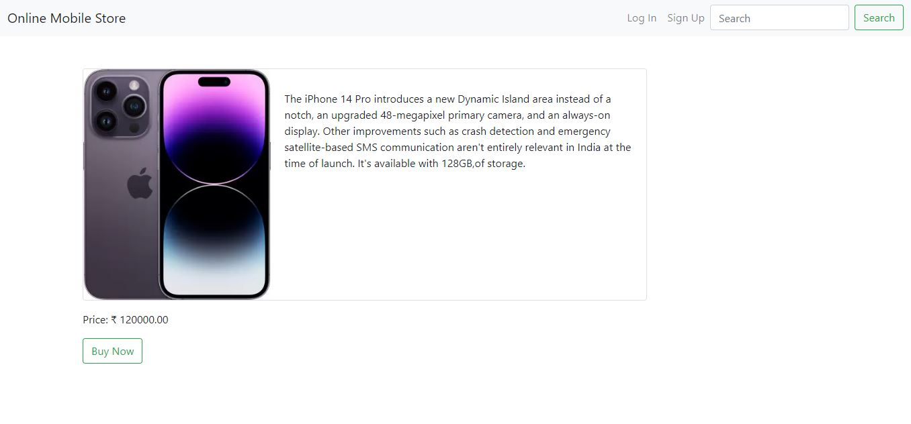
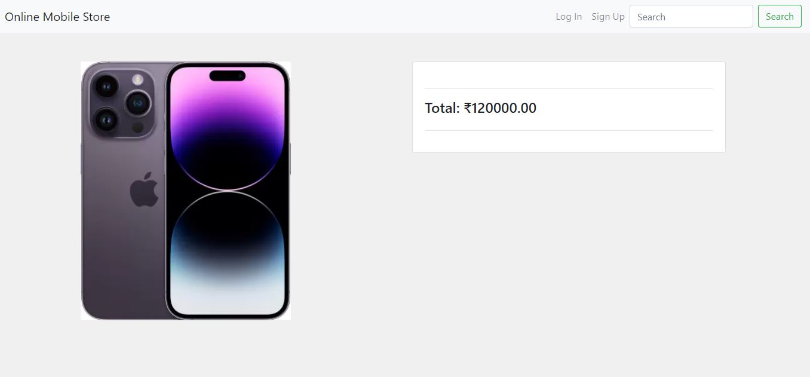
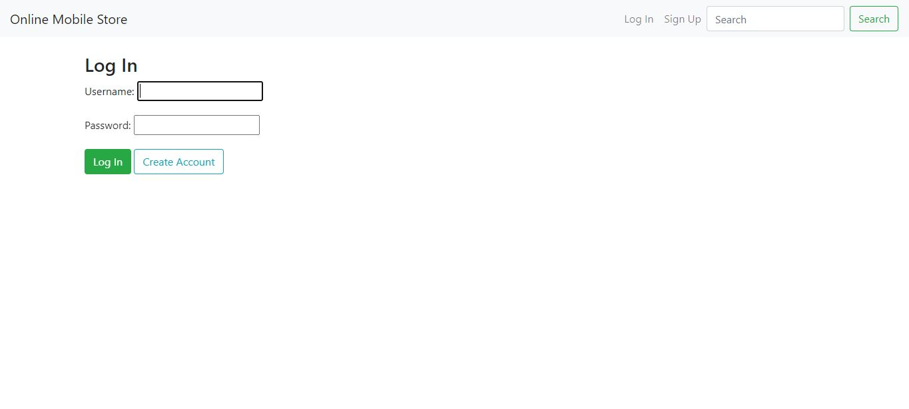
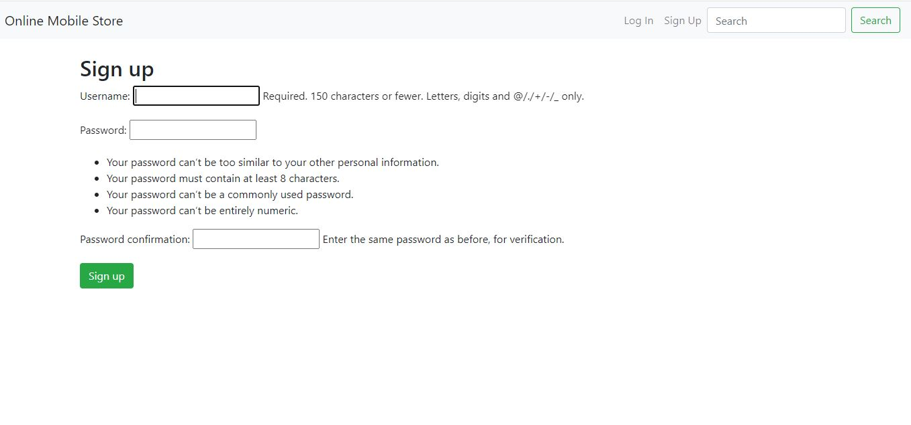

# Online-Mobile-Store with django,html and css
## An online mobile store developed in django-3.11 which allow users to purchase mobile online 

### About_the_App
Online Mobile store  this site allows you to search your favourite mobiles in the store, before purchasing any mobile you will be redirected to the login or signup page. So that new users can signup on the site and then can buy the mobile. The site also informs which mobile is available and which one is out of stock !.

# Getting Started
This project was styled with html and css to Create python django

## Available Scripts
In the project directory, you can run:

(django_project)$django-admin startproject ecommerce_project . 

(django_project)$python manage.py startapp accounts
(django_project)$python manage.py startapp mobiles

Now, open  vs code and locate this project directory. note that at this point django doesnt know about this app, therefore we need to mention this app name inside our settings.py file.

### make migration
django-admin makemigrations [app_label [app_label ...]]¶
Creates new migrations based on the changes detected to your models. Migrations, their relationship with apps and more are covered in depth in the migrations documentation
### migrate
django-admin migrate [app_label] [migration_name]¶
Synchronizes the database state with the current set of models and migrations. Migrations, their relationship with apps and more are covered in depth in the migrations documentation.